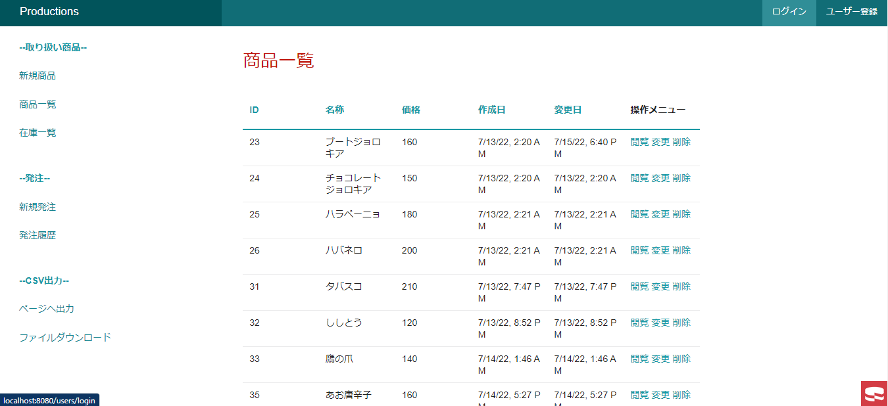
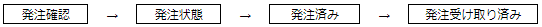
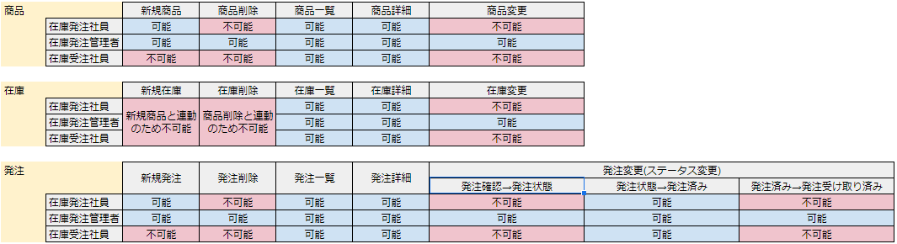

# TOPページ  
初期状態：商品一覧テーブルの一覧が表示されている  

取扱商品(サイドバー)：新規商品、商品一覧、在庫一覧  
　発注　(サイドバー)：新規発注、発注履歴  
CSV出力 (サイドバー)：ページへ出力、ファイルダウンロード  

図1：トップページ

# 取扱商品
取り扱い中の商品を管理するメニュー  
新規商品の登録や取扱商品の一覧表示を行える
### 新規商品
商品を新しく登録することができる
### 商品一覧
取り扱い中の商品の名称と価格を一覧表示できる
### 在庫一覧
取り扱い中の商品の名称と在庫数を一覧表示できる
  
  
# 発注  
新規発注、発注履歴、ステータス変更によって発注の進捗管理ができる  
またユーザー権限により行える発注操作に制限がある

### 新規発注
新規発注ボタンにより発注を行うことができる  
取り扱い商品の中から発注する選択することができる。

### 発注履歴
過去の発注履歴を表示することができる  
また発注履歴の変更からステータス変更に進むことができる  
ステータス変更を行うことによって下図の順番でステータスが推移する  
  

ステータスが前述の通りに遷移し、最後の発注受け取り済みになったときに発注数が在庫数に加算される  
各ステータスの変更権限は後述する  

### ユーザー権限
各ユーザーに与えられた権限によって下図の通り行える操作が制限されている  

# CSV出力
### ページへ出力
CSV形式で在庫一覧をブラウザ画面に出力することができる
### ファイルダウンロード
csv形式のファイルをダウンzロードすることができる
