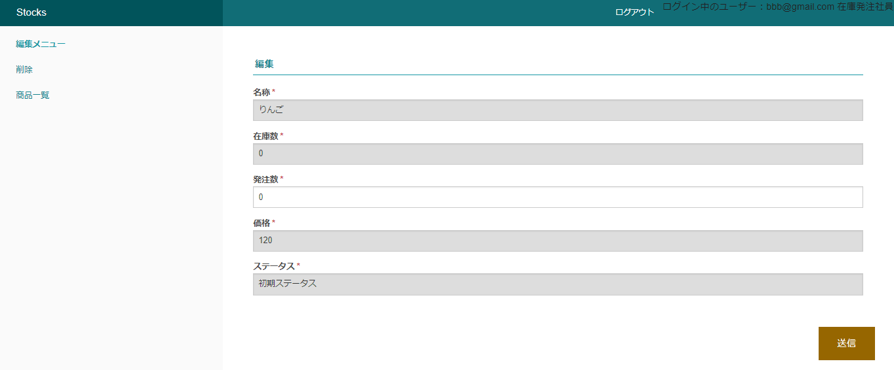

# TOPページ  
初期状態：stocksテーブルの一覧が表示されている  
ボタン表示：新規商品、閲覧、編集、削除、ユーザー登録、ログイン  
ユーザー権限：在庫発注社員、在庫発注管理者、在庫受注社員  

# 発注機能  
発注数のみ編集可能  
ステータスが後述の通りに遷移  
ステータスが最後の発注受け取り済みになったときに  
発注数が在庫数に加算されて発注数が0にリセットされる  

## ステータス遷移
編集を行うことによって下図の順番で推移  
ログイン中のユーザーを判別して遷移先を自動で変更（ユーザー自身は選択不可）  
  
作成時のステータスは初期ステータス  
2巡目以降は初期ステータスが存在せず、発注受け取り済みから始まる  
  